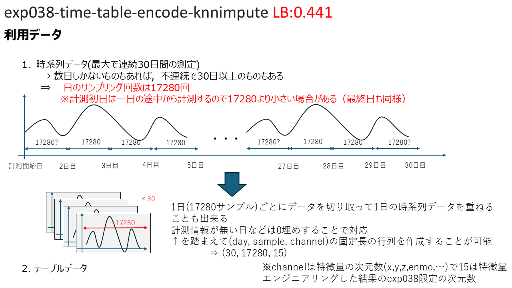

# Data & Model Architecture

# Experiment Results

| Experiment | CV | Tuned CV |
|------------|----|----------|
| exp003-time-table-encode-skf | 0.373 | 0.373 |
| exp003-time-table-encode | 0.369 | 0.432 |
| exp004-timeoverlap-table-encode-skf | 0.354 | 0.361 |
| exp004-timeoverlap-table-encode | 0.363 | 0.408 |
| exp006-time-table-encode-skf-cv038 | 0.382 | 0.418 |
| exp006-time-table-encode-skf-nonMHA | 0.375 | 0.374 |
| exp008-time-table-encode-skf-MHA-oquery | 0.379 | 0.381 |
| exp008-time-table-encode-skf-MHA | 0.368 | 0.422 |
| exp008-time-table-encode-skf-mask | 0.373 | 0.400 |
| exp009-time-table-encode-skf-MHA-oquery | 0.380 | 0.391 |
| exp011-time-table-encode-skf | 0.398 | 0.399 |
| exp013-time-table-encode-skf-MHA | 0.417 | 0.447 |
| exp014-time-table-encode-skf-MHA | 0.385 | 0.405 |
| exp015-time-table-encode-skf-MHA | 0.393 | 0.440 |
| exp016-time-table-encode-skf-MHA | 0.408 | 0.434 |
| exp018-table-encode-only | 0.391 | 0.399 |
| exp018-time-table-encode-addfeature | 0.403 | 0.455 |
| exp019-time-table-encode-addfeature | 0.397 | 0.422 |
| exp020-time-table-encode-addfeature | 0.428 | 0.431 |
| exp021-time-table-encode-leak | 0.455 | 0.463 |
| exp023-time-table-encode-knnimpute | 0.442 | 0.473 |
| exp024-time-table-encode-knnimpute | 0.444 | 0.449 |
| exp025-time-table-encode-knnimpute-multitask | 0.406 | 0.450 |
| exp026-time-table-encode-knnimpute-multitask | 0.414 | 0.418 |
| exp027-time-table-encode-simpleimpute | 0.423 | 0.441 |
| exp028-time-table-encode-dropna | 0.385 | 0.436 |
| exp029-time-table-encode-dropna-noutput | 0.385 | 0.444 |
| exp030-time-table-encode-dropna-noutput | 0.373 | 0.442 |
| exp031-time-table-encode-copy-bunny | 0.455 | 0.489 |
| exp032-time-table-encode-copy-bunny | 0.378 | 0.430 |
| exp033-time-table-encode-copy-bunny | 0.455 | 0.489 |
| exp034-time-table-encode-copy-bunny | 0.392 | 0.436 |
| exp035-time-table-encode-copy-bunny | 0.385 | 0.396 |
| exp036-time-table-encode-impute-bunny | 0.381 | 0.387 |
| exp037-time-table-encode-knnimpute-multitask | 0.400 | 0.446 |
| exp038-time-table-encode-knnimpute | 0.393 | 0.443 |
| exp039-time-autoencoder-transformer-v2 | None | None |
| exp039-time-autoencoder-transformer | None | None |
| exp040-time-autoencoder-lstm | None | None |
| exp041-time-autoencoder-cnn | None | None |
| exp042-lstm-cnnencoder-boosting-voting | None | None |
| lstm-model | 0.409 | 0.441 |
| exp043-lstm-cnnencoder-boosting-voting | None | None |
| lstm-model | 0.409 | 0.441 |
| exp044-lstm-cnnencoder-boosting-voting | None | None |
